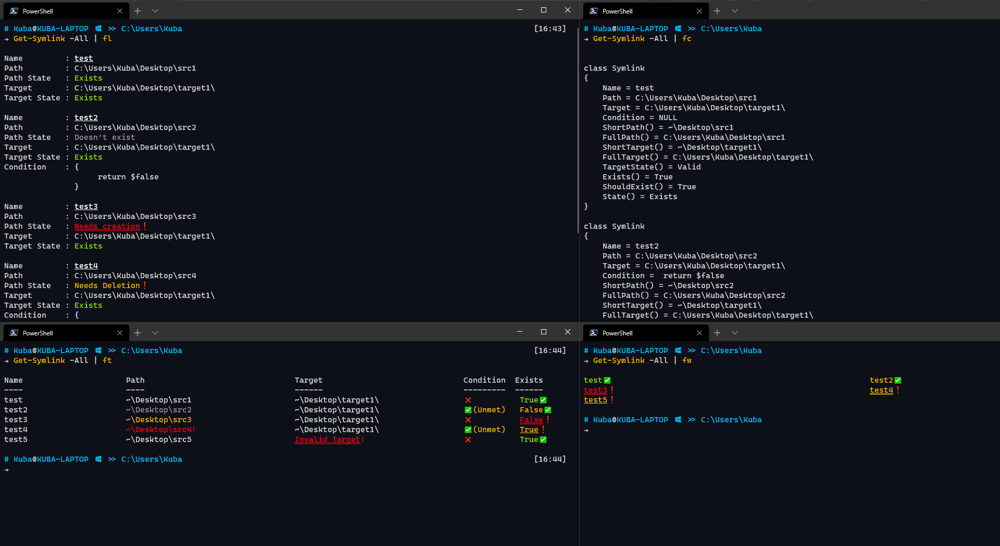

# Symlink
Symlink is a module designed to help manage symbolic links on the filesystem, by improving the user experience and making it easier to create, modify, and remove symlinks.

This module is aimed at anyone who manages many symlinks on their system, either on a singular machine or on multiple ones. There are extra features in this module which allow the same symlink database to work on multiple systems with varying requirements.

<br>

[](https://dev.azure.com/KubaP999/Symlink/_build?definitionId=13)
[](https://www.powershellgallery.com/packages/Symlink)

[](./LICENSE)

### Table of Contents
1. [Getting Started](#getting-started)
2. [Information & Features](#information--features)
3. [Build Instructions](#build-instructions)
4. [Support](#support)
5. [Contributing](#contributing)
6. [License](#license)

## Getting Started
### Installation
In order to get started with the latest version, simply download the module from the [PSGallery](https://www.powershellgallery.com/packages/Symlink), or install it from powershell by running:
```powershell
Install-Module Symlink
```
Installing this module does not mean that it is loaded automatically on start-up. Powershell supports loading modules on-the-fly since v3, however the first time you run a command it can be a bit slow to tab-complete parameters or values. If you would like to load this module on shell start-up, add the following line to `~\Documents\Powershell\Profile.ps1`:
```powershell
Import-Module Symlink
```

### Requirements
This module requires minimum `Powershell 6`.

This module works on **Windows** only.

### Creating a new Symlink
To create a new symlink, run:
```powershell
PS C:\> New-Symlink -Name "data" -Path "~\Documents\Data" -Target "D:\Files"
```
This command will create a new symlink definition, named `data`, and a
symbolic-link located in the user's document folder under a folder also
named `Data`, pointing to a folder on the `D:\` drive.

### Retrieving the details of a Symlink
To retrieve the details of a symlink, run:
```powershell
PS C:\> Get-Symlink -Name "data"
```
This command will retrieve the details of the symlink named `data`, and
output the information to the screen.

### Removing a Symlink
To remove a symlink, run:
```powershell
PS C:\> Remove-Symlink -Name "data"
```
This command will remove a symlink definition, named `data`, and delete the
symbolic-link item from the filesystem.

## Information & Features
### Documentation
For a detailed rundown and explanation of all the features in this module, view the **help page** by running:
```powershell
Get-Help about_Symlink
```
For detailed help about a specific command, run:
```powershell
Get-Help <COMMAND NAME> -Full
```

### Extra features
#### Aliases
The cmdlets in this module have default aliases:
|Cmdlet 	     |Alias|
|----------------|-----|
|New-Symlink     | nsl |
|Get-Symlink     | gsl |
|Set-Symlink     | ssl |
|Remove-Symlink  | rsl |
|Build-Symlink   | bsl |

#### Tab completion
The `-Name`/`-Names` parameter supports tab-completion of valid **existing** symlink names in the following cmdlets:
- `Get-Symlink`
- `Set-Symlink`
- `Remove-Symlink`
- `Build-Symlink`

#### Custom scriptblock evaluation
When creating a new symlink, you can pass in a scriptblock which will evaluate whether the symbolic-link item should get created on the filesystem.

For details, see the `CREATION CONDITION SCRIPTBLOCK` section in the help at: `about_Symlink`.

#### -WhatIf and -Confirm support
The following cmdlets support `-WhatIf` and `-Confirm` parameters:
- `New-Symlink`
- `Remove-Symlink`
- `Set-Symlink`
- `Build-Symlink`

Use `-WhatIf` to see a list of what changes a command will do.

Use `-Confirm` to ask for a prompt for every state-altering change.

#### Formatting
The `[Symlink]` object within this module has custom formatting rules for all views. Simply pipe the output of the `Get-Symlink` cmdlet to one of:
| Cmdlet        | Alias |
|---------------|-------|
| Format-List   |  fl   |
| Format-Table  |  ft   |
| Format-Custom |  fc   |
| Format-Wide   |  fw   |

The `Format-Custom` & `Format-List` views contain the largest amount of information regarding the symlink.

⚠This module supports "Fancy" formatting (using extra ANSI codes and emoijs) for enhanced readability. This *only* works within the **Windows Terminal** at the moment (I've not tested this on other terminal emulators, but if you know that they support these extra formatting features then let me know). The example below shows the enhanced formatting.



## Build Instructions
#### Prerequisites
Install the following:
- Powershell Core 7.0.0+
- Pester **4.10.1**
- PSScriptAnalyzer 1.18.0+

#### Clone the git repo
```
git clone https://github.com/KubaP/Powershell-Symlink.git
```

#### Run the build scripts
Navigate to the root repository folder and run the following commands:
```powershell
& .\build\vsts-prerequisites.ps1
& .\build\vsts-validate.ps1
& .\build\vsts-build-prerequisites
& .\build\vsts-build.ps1 -WorkingDirectory .\ -SkipPublish
```
The built module will be located in the `.\publish` folder.

## Support
⚠If you need help regarding the usage of the module, please see the **help page** by running `Get-Help about_Symlink`.

If there is a bug/issue, please file it on the github issue tracker.

## Contributing
If you have a suggestion, create a new **Github Issue** detailing the idea.

Feel free to make pull requests if you have an improvement. Only submit a single feature at a time, and make sure that the code is cleanly formatted, readable, and well commented.

## License 
This project is licensed under the GPLv3 license - see [LICENSE.md](./LICENSE) for details.
